# HIMPAUDI Bekasi Timur - Platform Website

Platform digital terpadu untuk Himpunan Pendidik dan Tenaga Kependidikan Anak Usia Dini (HIMPAUDI) Kecamatan Bekasi Timur. Website ini menyediakan sistem manajemen anggota, berita, galeri, forum diskusi, dan berbagai fitur pendukung lainnya.

## 🚀 Fitur Utama

-   **Manajemen Anggota**: Pendaftaran online, verifikasi admin, profil lengkap (data pribadi & lembaga)
-   **Berita & Artikel**: Publikasi berita dengan multiple photos, thumbnail, dan slug otomatis
-   **Galeri Foto**: Dokumentasi kegiatan dengan kategori dan tanggal kegiatan
-   **Forum Diskusi**: Platform kolaborasi dan diskusi antar anggota
-   **Struktur Organisasi**: Tampilan struktur pengurus HIMPAUDI
-   **FAQ**: Pertanyaan yang sering diajukan
-   **Visi Misi**: Manajemen visi dan misi organisasi
-   **Info Kontak**: Informasi kontak dinamis
-   **Email Notification**: Notifikasi otomatis untuk approval/rejection member
-   **Multi-role**: Admin dan Member dengan dashboard terpisah

## 📊 Rancangan Komponen

### Flowchart Interaksi User

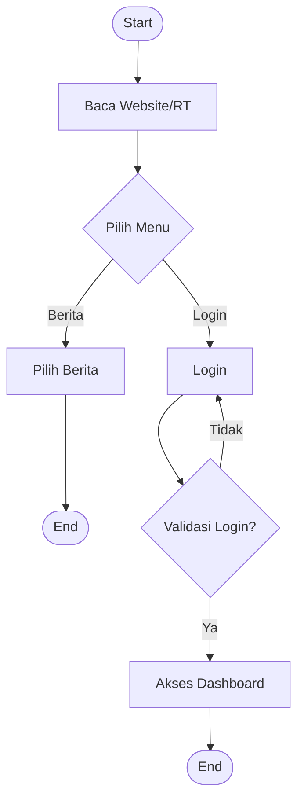

### Flowchart Registrasi Member

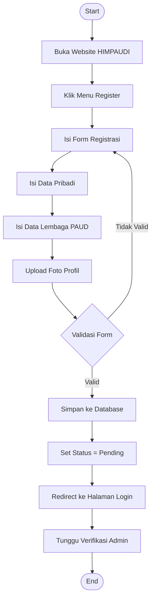

### Flowchart Verifikasi Admin

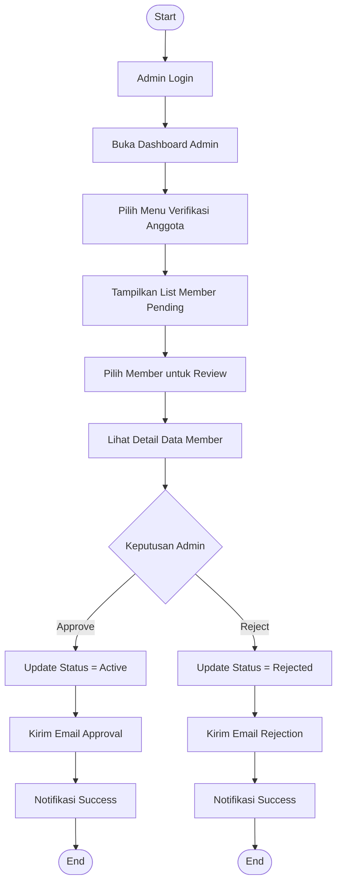

### Flowchart Kelola Berita

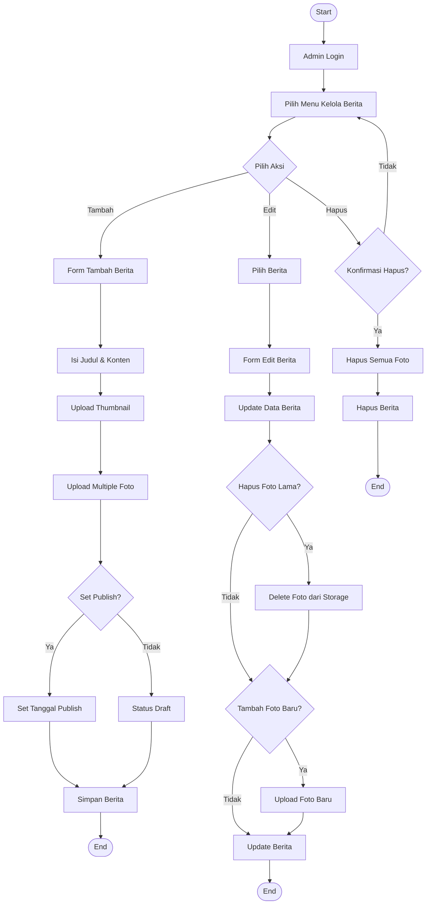

### Arsitektur Sistem

```mermaid
graph TB
    subgraph "Frontend Layer"
        A[Public Pages] --> A1[Landing Page]
        A --> A2[Berita]
        A --> A3[Galeri]
        A --> A4[Forum]
        A --> A5[Struktur Organisasi]

        B[Auth Pages] --> B1[Login]
        B --> B2[Register]

        C[Member Dashboard] --> C1[Profile]
        C --> C2[Data Lembaga]
        C --> C3[Forum Diskusi]

        D[Admin Dashboard] --> D1[Kelola Anggota]
        D --> D2[Kelola Berita]
        D --> D3[Kelola Galeri]
        D --> D4[Kelola Forum]
        D --> D5[Visi Misi]
        D --> D6[FAQ]
        D --> D7[Info Kontak]
    end

    subgraph "Backend Layer"
        E[Controllers] --> E1[Auth Controller]
        E --> E2[Member Controller]
        E --> E3[Berita Controller]
        E --> E4[Galeri Controller]
        E --> E5[Forum Controller]

        F[Models] --> F1[User]
        F --> F2[DataPribadi]
        F --> F3[DataLembaga]
        F --> F4[Berita]
        F --> F5[BeritaPhoto]
        F --> F6[Galeri]
        F --> F7[Forum]
        F --> F8[VisiMisi]
        F --> F9[FAQ]
        F --> F10[ContactInfo]

        G[Services] --> G1[Email Service]
        G --> G2[Storage Service]
        G --> G3[Queue Service]
    end

    subgraph "Database Layer"
        H[(MySQL)] --> H1[users]
        H --> H2[data_pribadi]
        H --> H3[data_lembaga]
        H --> H4[berita]
        H --> H5[berita_photos]
        H --> H6[galeri]
        H --> H7[forum]
        H --> H8[visi_misi]
        H --> H9[faq]
        H --> H10[contact_info]
    end

    A --> E
    B --> E1
    C --> E
    D --> E
    E --> F
    F --> H
    G1 -.Email Notification.-> E2
    G2 -.File Upload.-> E3
    G2 -.File Upload.-> E4
    G3 -.Queue Jobs.-> G1
```

### Alur Verifikasi Member

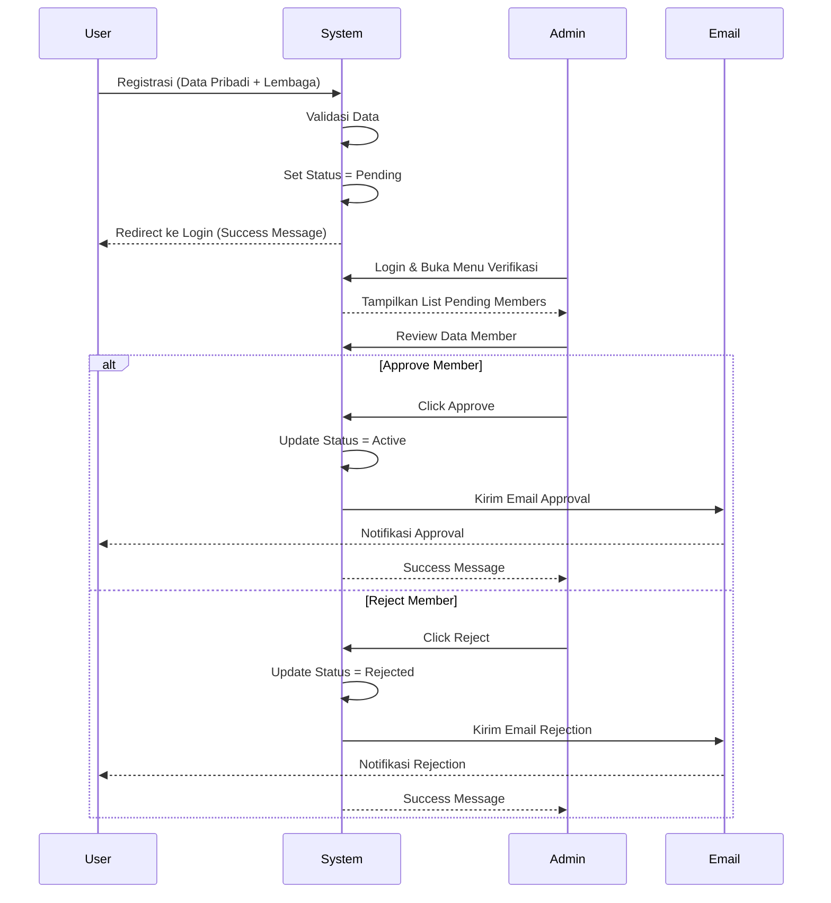

### Entity Relationship Diagram

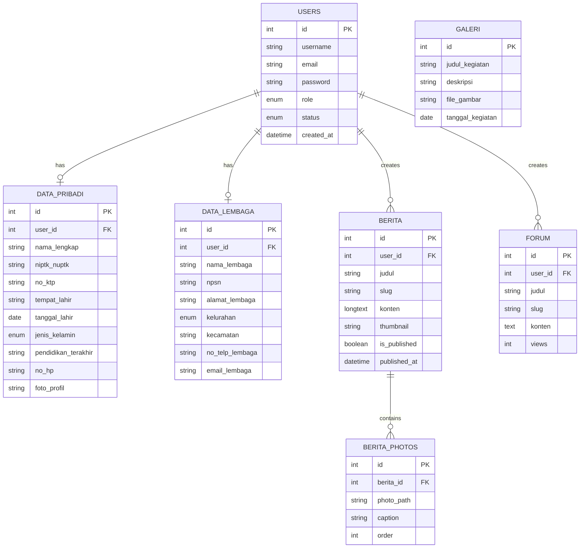

### UML Class Diagram

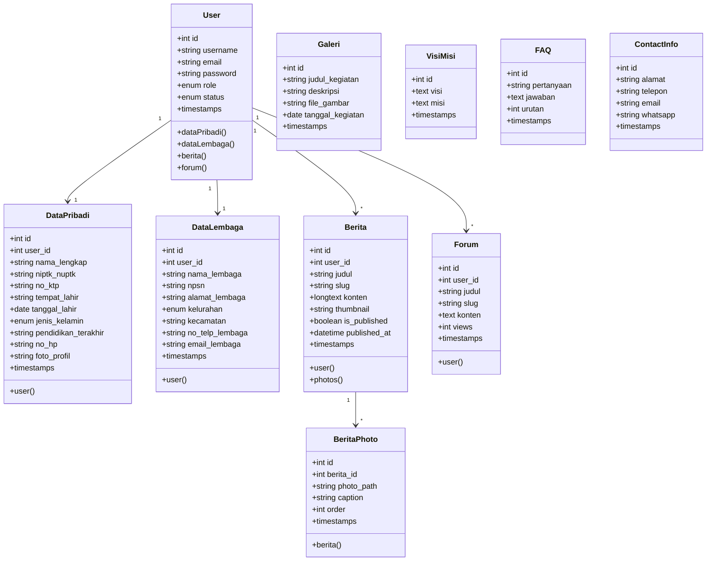

### UML Use Case Diagram

```mermaid
flowchart TB
    subgraph "HIMPAUDI System"
        UC1[Registrasi Member]
        UC2[Login]
        UC3[Lihat Berita]
        UC4[Lihat Galeri]
        UC5[Lihat Forum]
        UC6[Lihat Struktur Organisasi]
        UC7[Edit Profil]
        UC8[Edit Data Lembaga]
        UC9[Buat Topik Forum]
        UC10[Verifikasi Member]
        UC11[Kelola Berita]
        UC12[Kelola Galeri]
        UC13[Kelola Forum]
        UC14[Kelola Visi Misi]
        UC15[Kelola FAQ]
        UC16[Kelola Info Kontak]
    end

    Guest((Guest User))
    Member((Member))
    Admin((Admin))

    Guest --> UC1
    Guest --> UC2
    Guest --> UC3
    Guest --> UC4
    Guest --> UC5
    Guest --> UC6

    Member --> UC2
    Member --> UC3
    Member --> UC4
    Member --> UC5
    Member --> UC6
    Member --> UC7
    Member --> UC8
    Member --> UC9

    Admin --> UC2
    Admin --> UC10
    Admin --> UC11
    Admin --> UC12
    Admin --> UC13
    Admin --> UC14
    Admin --> UC15
    Admin --> UC16
```

### UML Activity Diagram - Proses Verifikasi Member

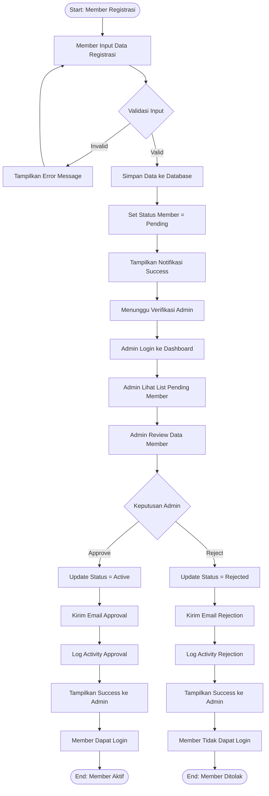

### UML Activity Diagram - Kelola Berita dengan Multiple Photos

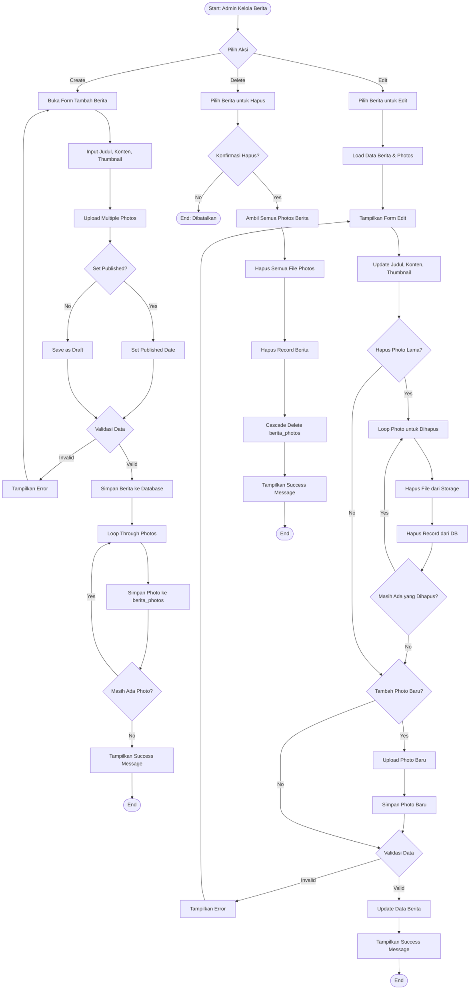

## 📋 Persyaratan Sistem

-   PHP >= 8.2
-   Composer
-   Node.js & NPM
-   MySQL/MariaDB >= 5.7
-   Web Server (Apache/Nginx)

## 🛠️ Instalasi

### 1. Clone Repository

```bash
git clone https://github.com/mmararief/himpaudi-bektim.git
cd himpaudi-bektim
```

### 2. Install Dependencies

```bash
# Install PHP dependencies
composer install

# Install Node.js dependencies
npm install
```

### 3. Konfigurasi Environment

```bash
# Copy file .env example
cp .env.example .env

# Generate application key
php artisan key:generate
```

### 4. Konfigurasi Database

Edit file `.env` dan sesuaikan dengan konfigurasi database Anda:

```env
DB_CONNECTION=mysql
DB_HOST=127.0.0.1
DB_PORT=3306
DB_DATABASE=himpaudi_bektim
DB_USERNAME=root
DB_PASSWORD=
```

### 5. Konfigurasi Email (Opsional)

Untuk fitur notifikasi email, konfigurasikan SMTP di file `.env`:

```env
MAIL_MAILER=smtp
MAIL_HOST=smtp.gmail.com
MAIL_PORT=587
MAIL_USERNAME=your-email@gmail.com
MAIL_PASSWORD=your-app-password
MAIL_ENCRYPTION=tls
MAIL_FROM_ADDRESS="your-email@gmail.com"
MAIL_FROM_NAME="HIMPAUDI Bekasi Timur"
```

**Catatan**: Untuk Gmail, gunakan [App Password](https://support.google.com/accounts/answer/185833) bukan password biasa.

### 6. Migrasi Database dan Seeder

```bash
# Jalankan migrasi
php artisan migrate

# (Opsional) Jalankan seeder untuk data awal
php artisan db:seed
```

### 7. Setup Storage

```bash
# Buat symbolic link untuk storage
php artisan storage:link
```

### 8. Build Assets

```bash
# Development
npm run dev

# Production
npm run build
```

### 9. Jalankan Aplikasi

```bash
# Development server
php artisan serve
```

Buka browser dan akses: `http://localhost:8000`

### 10. Setup Queue Worker (Opsional)

Untuk email notification yang optimal:

```bash
# Development
php artisan queue:work

# Atau dengan listen (auto-reload)
php artisan queue:listen
```

## 👤 Akun Default

Setelah menjalankan seeder, Anda dapat login dengan akun:

**Admin:**

-   Email: admin@himpaudi-bektim.org
-   Password: password

## 📁 Struktur Folder Penting

```
himpaudi-bektim/
├── app/
│   ├── Http/Controllers/
│   │   ├── Admin/          # Controller untuk admin
│   │   ├── Auth/           # Authentication controllers
│   │   └── ...
│   ├── Models/             # Eloquent models
│   └── Mail/               # Email templates (Mailables)
├── database/
│   ├── migrations/         # Database migrations
│   └── seeders/            # Database seeders
├── public/
│   └── images/             # Logo dan gambar statis
├── resources/
│   ├── views/              # Blade templates
│   │   ├── admin/          # Admin views
│   │   ├── auth/           # Authentication views
│   │   ├── berita/         # Berita public views
│   │   ├── galeri/         # Galeri views
│   │   └── ...
│   ├── css/                # Stylesheets
│   └── js/                 # JavaScript files
├── routes/
│   └── web.php             # Web routes
└── storage/
    └── app/public/         # Uploaded files
```

## 🎨 Teknologi yang Digunakan

-   **Framework**: Laravel 11.x
-   **Frontend**: Tailwind CSS, Alpine.js (via Breeze)
-   **Authentication**: Laravel Breeze
-   **Database**: MySQL
-   **Email**: Laravel Mail + Queue
-   **File Storage**: Laravel Storage (local/public disk)

## 📝 Fitur Admin

1. **Dashboard**: Overview statistik
2. **Manajemen Anggota**: Verifikasi, edit, hapus member
3. **Kelola Berita**: CRUD berita dengan multiple photos
4. **Kelola Galeri**: Upload dan manajemen foto kegiatan
5. **Kelola Forum**: Moderasi diskusi
6. **Visi Misi**: Update visi dan misi
7. **FAQ**: Manajemen pertanyaan umum
8. **Info Kontak**: Update informasi kontak

## 📝 Fitur Member

1. **Dashboard**: Akses informasi personal
2. **Profil**: Edit data pribadi dan data lembaga
3. **Forum**: Buat topik dan diskusi
4. **Galeri**: Lihat dokumentasi kegiatan
5. **Berita**: Baca berita terbaru

## 🔐 Keamanan

-   Password hashing menggunakan bcrypt
-   CSRF protection
-   SQL injection prevention (Eloquent ORM)
-   XSS protection
-   Email verification (optional)
-   Role-based access control

## 🐛 Troubleshooting

### Error 500 setelah instalasi

```bash
php artisan config:clear
php artisan cache:clear
php artisan route:clear
php artisan view:clear
```

### Gambar tidak muncul

```bash
php artisan storage:link
```

### Email tidak terkirim

-   Pastikan konfigurasi SMTP di `.env` sudah benar
-   Untuk Gmail, gunakan App Password
-   Jalankan `php artisan queue:work`
-   Cek log di `storage/logs/laravel.log`

### Asset tidak ter-build

```bash
npm install
npm run build
```

## 📄 License

Project ini menggunakan framework Laravel yang berlisensi [MIT license](https://opensource.org/licenses/MIT).

---
